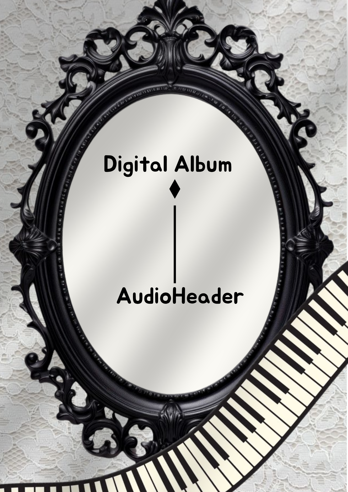
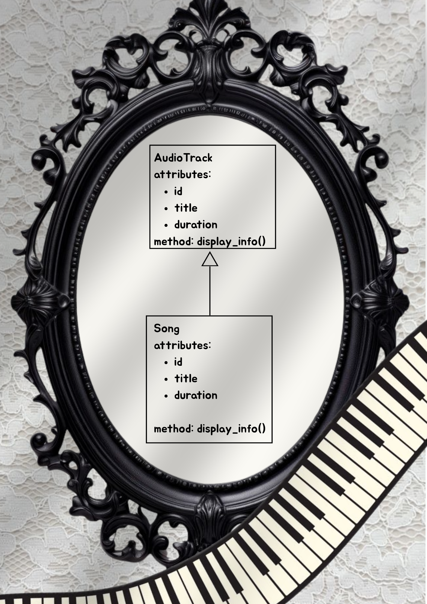
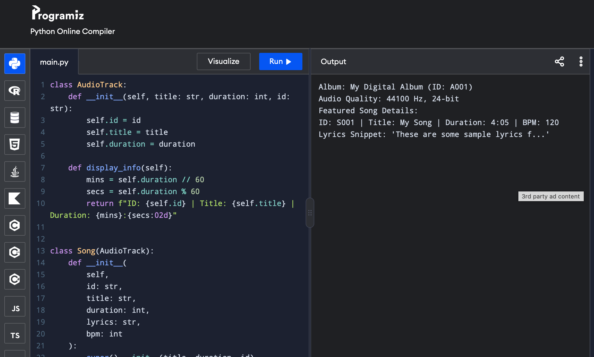
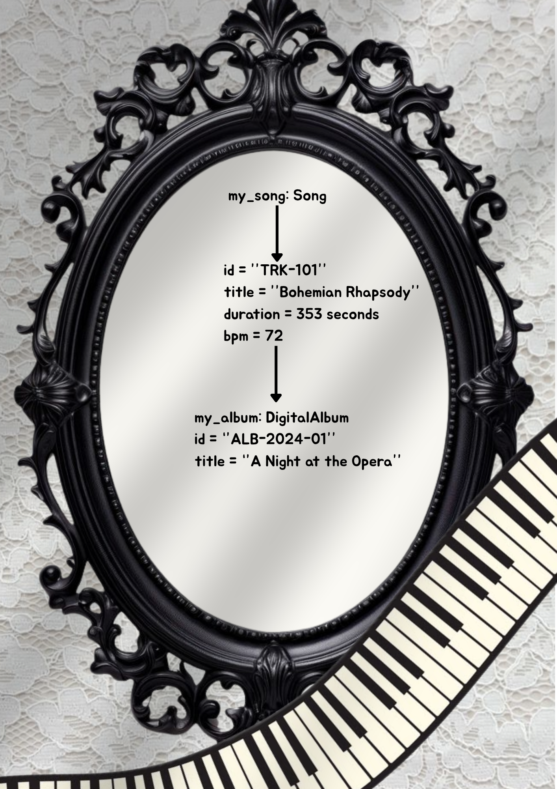

# Advanced Class Relationships

## Previous Activities
[classAttrib](classAttributesMethods.md)
[classRel](classRelationships.md)

## Existing System Description:
From part III, the music management engaged between songs, albums, and artists. However, individual songs contained redundant audio properties that needed more specific info.

## Inheritance Relationship
Parent: AudioTrack
Child: Song
Explanation: I likely chose song as the child because it inherits stuff like the title, track id, and the duration of the songs.

## Inheritance UML

## Composition/Aggregation
Relationship: Composition
Explanation: An AudioHeader is created by the DigitalAlbum to store the file encodings, so if the DigitalAlbum was deleted, its AudioHeader object is ruined with it, giving a strong dependency.

## Advanced UML Diagram

## Python Implementation
[Source Code](advancedRelationships.py)

## Test Run

## Object Diagram

## Reflection
Answers:
I chose AudioTrack as a parent class for Song because a song is a musical audio recording. Therefore, it defines AudioTrack as the base class that allows the system to add other types in the future while sharing the title and duration.

Inheritance reduced the need to re-declare audio paremeters in the Song class.

The relationship between DigitalAlbum and AudioHeader is composition because the AudioHeader object is part directly inside the "DigitalAlbum.__init__()".

Association in Part III represented a loose independent relationship where objects were aware but mostly managed themselves. The contained child object like the AudioHeader cannot exist without the parent which is the Digital Album.

The design follows the DRY principle by centralizing shared audio attributes and format of time in the AudioTracker parent class.
