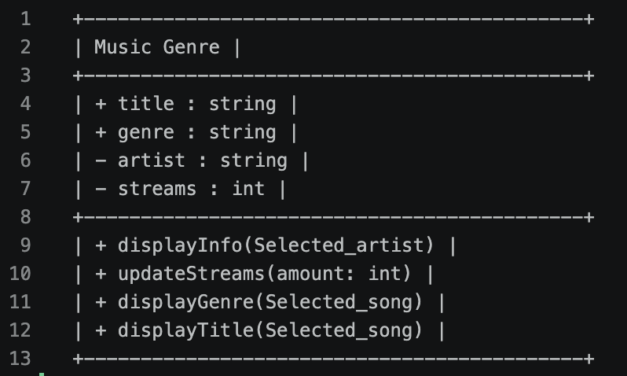
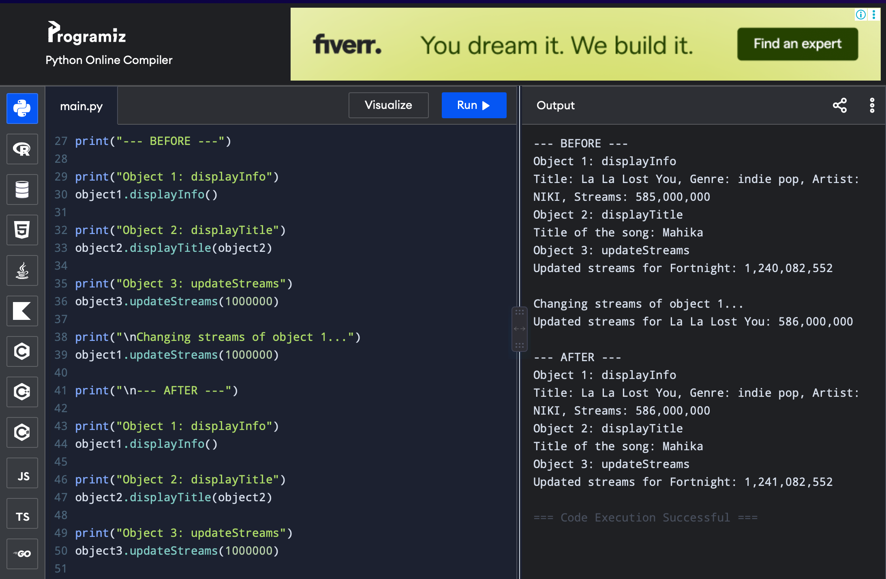
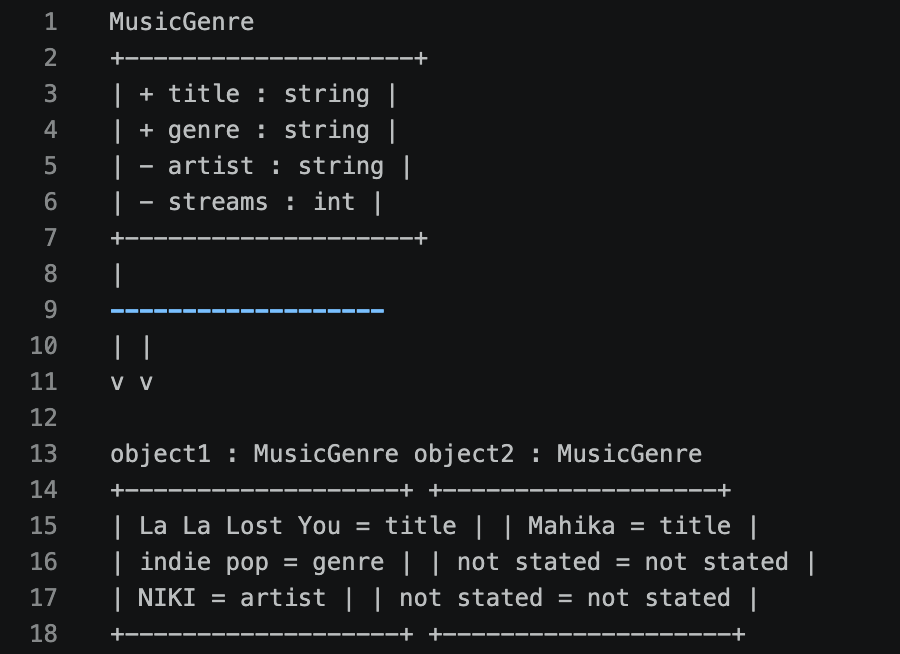

# Class Attributes and Methods

## Previous Design
Link to my previous activity:
[classObjectUML.md](classObjectUML.md)

## Design Revision
Describe any changes made to your original class.
    
## Visibility Decisions
| Attribute | Data Type | Visibility | Reason |
| Title | string | Public | This is necessary to be public for the listeners interest in what he or she is listening to. |
| Genre | string | Public | This is necessary to be public because this is the main goal of my class-- therefore, it must be important for the listeners to know what genre is the song they're listening to. |
| Artist | string | Private | This is not mainly the artist, what I am talking about here is more of the artists' private information such as contacts, hometown and background, or financial data. The only necessary one for here is the artists' NAME. |
| Streams | int | Private | Again this is not mainly about the streams, the part that is only private about this attribute is about the estimated income or business size. |

## Updated UML Class Diagram

## Python Implementation
[View Python Source](classImplementation.py)

## Test Run

## Object Diagram

## Analysis

### Why did you make your chosen attribute private?

### Which method changes the state of your object?

### How did your two objects demonstrate that instances are independent?

### What is the difference between your class diagram and your object diagram?
