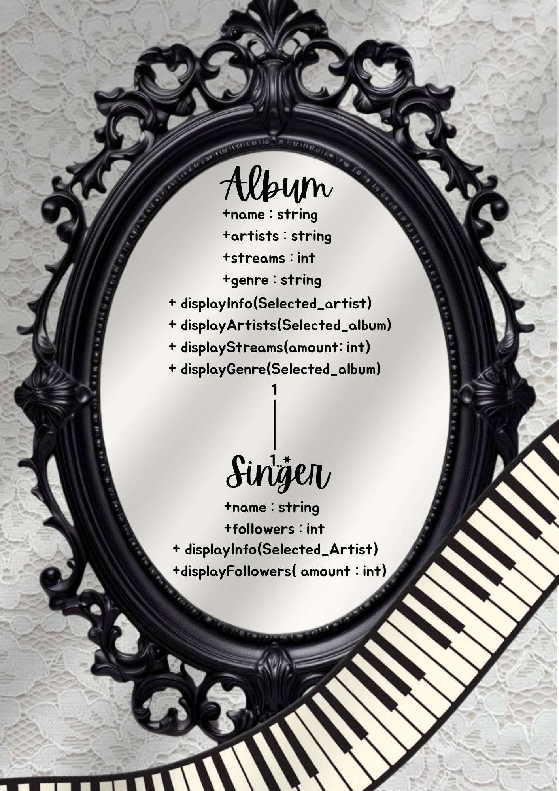
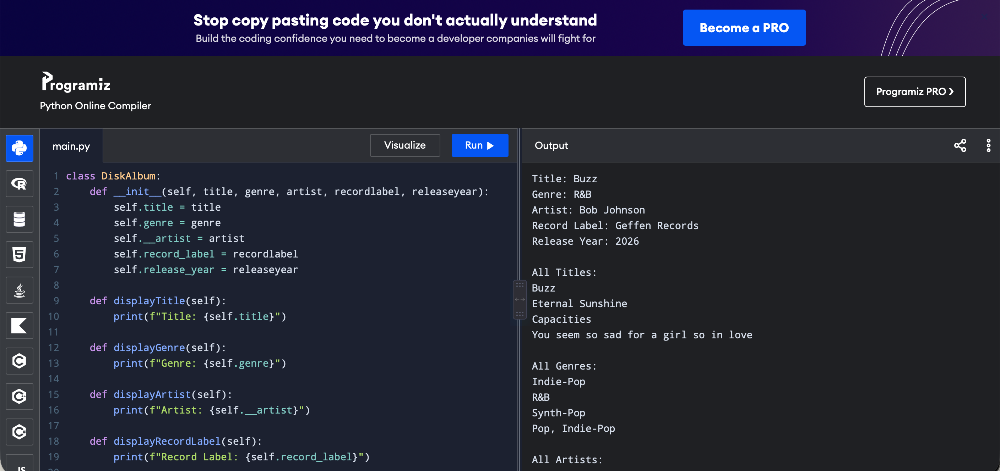
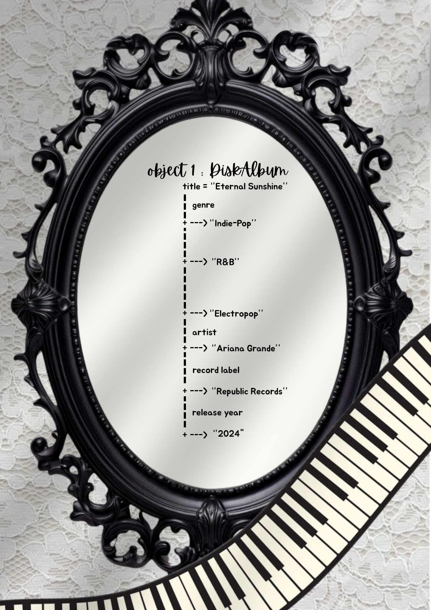

# Class Relationships: Association and Multiplicity

## Previous Work
[Part I - Classes and Objects](classObjectUML.md)
[Part II - Class Attributes and Methods](classAttributesMethods.md)

## Existing Class
Class: MusicGenre
Description: My class represents the diverse genre that is popular in different generations.

## New Related Class
Class: DiskAlbum
Description: My new class represents the physical copy of how a music can be played, regarding what song it is or what genre.

## Association
Relationship: Music artists HAS albums.
Explanation: I chose to make this kind of relationship because artists most likely have many songs that they all want to connect together in one genre, or category. Therefore, they create an ALBUM-- to show organized songs and music styles in different categories.

## Multiplicity
Multiplicity: 1 Album─────────1..* Singer
Explanation: This multiplicity fits my system because as a person who listens to music, I like it when some of my favorite music artists "collab" in an album, therefore, it also musical blending. But besides of 2 people creating music to 1 album, a singer can also choose sing alone, which in modern music terms is having a "solo".

## UML Class Relationship Diagram

## Python Implementation
[View Python Source](classRelationships.py)

## Test Run

## Object Relationship Diagram

## Analysis
### What is the association between your two classes?
DiskAlbum is associated with an artist because each album has an artist. The association between the DiskAlbum and Artist classes is that an artist can create or have multiple albums.

### What multiplicity did you choose and why?
I chose one to many because many albums may also belong to one artist, vice versa. For example, one artist can have multiple albums. Another example that I've also previously said was many artists can also collaborate in one album, which is already following the multiplicity. This is appropriate because an artist may not have any albums yet, but an artist can also have multiple albums.

### How did you implement the relationship in Python?
I implemented the relationship by storing an artist object as an attribute inside my DiskAlbum object. The artist attribute stores the related Artist object. 

### Why did you store an object reference instead of copying its data?
I store the object reference so the album can directly refer to the artist object. This will probably avoid duplication of the artist's information. Besides this, this will also allow the same artist object to be used by multiple albums.For example, instead of storing "NIKI" as separate copied data, the album can store a reference to the Artist object representing NIKI.

### If your relationship uses many, why is a list appropriate?
In my observation, a list is appropriate when one object can associated with multiple objects. For example, an artist's list could contain object1, object2, and object3, where each object is a different DiskAlbum. Therefore, it allows multiple albums to be stored and accessed together.
